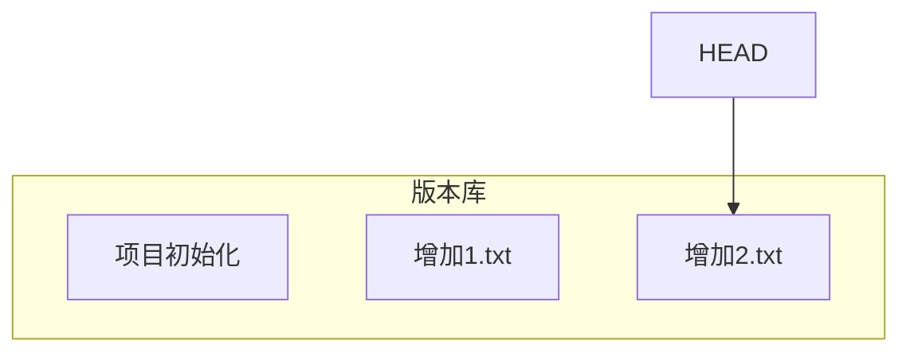

# day01

[toc]


## 版本控制

### 版本库

- 版本控制是一种记录一个或若干文件内容变化，以便将来查阅特定版本修订情况的系统。
- 简单来说，就是为目录打快照。将来可以回到某一个历史记录点。

- 是一个典型的客户端/服务器模型（C/S模型）
- 版本库是版本控制的核心


## git

- 是一个分布式的代码管理工具
- 可以是C/S架构，也就是Client/Server
- 只要有适当的权限，每个客户端都可以下载或上传数据到服务器

### git的工作原理

- git重要的三个工作区域：
  - 工作区：写代码的目录。就是项目代码存放的目录。
  - 暂存区：工作区与版本库之间的缓冲地带。位置是`.git/index`
  - 版本库：工作区快照存放的目录。在工作区下，名为`.git`的目录

```sequence
工作区->暂存区:git add
暂存区->版本库:git commit
```

- 基本的 Git 工作流程如下：
  1. 在工作区中修改文件。
  2. 将想要提交的更改暂存，这样会将更改添加到暂存区。
  3. 提交更新，找到暂存区的文件，将快照永久性存储到 Git 目录。

### git环境准备

- automation部分的环境都采用RHEL8系统

| 主机名  | IP地址          | 角色      |
| ------- | --------------- | --------- |
| develop | 192.168.4.10/24 | git客户端 |
| git     | 192.168.4.20/24 | git服务器 |

```shell
[root@zzgrhel8 ~]# clone-vm8     # 创建RHEL8的脚本
Enter VM number: 1               # 输入节点的编号
[root@zzgrhel8 ~]# clone-vm8
Enter VM number: 2
[root@zzgrhel8 ~]# virsh list --all    # 查看所有的KVM虚拟机
 Id   名称           状态
------------------------------
 -    tedu8_node01   关闭
 -    tedu8_node02   关闭
# 打开图形控制台，启动虚拟机，默认密码是123456
[root@zzgrhel8 ~]# virt-manager


# 配置第一台机器为程序员所使用的机器
hostnamectl set-hostname develop   # 改主机名
nmcli connection modify eth0 ipv4.addresses 192.168.4.10/24  # 改IP
nmcli connection modify eth0 ipv4.method manual   # 改手工配置地址
nmcli connection down eth0     # 禁用网卡
nmcli connection up eth0       # 激活网卡
echo a | passwd --stdin root   # 改root密码为a
sed -i '/^SELINUX=/s/enforcing/disabled/' /etc/selinux/config  # 禁用selinux
setenforce 0      # 立即禁用selinux
systemctl stop firewalld.service       # 关防火墙
systemctl disable firewalld.service

# 配置第二台机器为git服务器
hostnamectl set-hostname git
nmcli connection modify eth0 ipv4.addresses 192.168.4.20/24
nmcli connection modify eth0 ipv4.method manual
nmcli connection down eth0 
nmcli connection up eth0
echo a | passwd --stdin root
sed -i '/^SELINUX=/s/enforcing/disabled/' /etc/selinux/config
setenforce 0
systemctl stop firewalld.service
systemctl disable firewalld.service
```

### git客户端

- 环境准备[192.168.4.10]

```shell
# 配置yum
[root@develop ~]# vim /etc/yum.repos.d/rhel8.repo 
[app]
name=app
baseurl=ftp://192.168.4.254/rhel8/AppStream
enabled=1
gpgcheck=0
[base]
name=base
baseurl=ftp://192.168.4.254/rhel8/BaseOS
enabled=1
gpgcheck=0

[root@develop ~]# yum repolist

# 安装git
[root@develop ~]# yum install -y git

# 设置使用者的名字和email地址
[root@develop ~]# git config --global user.name zhangzhg
[root@develop ~]# git config --global user.email zhangzg@tedu.cn

# 查看git配置信息
[root@develop ~]# git config --list
user.name=zhangzhg
user.email=zhangzg@tedu.cn
[root@develop ~]# cat ~/.gitconfig 
[user]
	name = zhangzhg
	email = zhangzg@tedu.cn
```

- 使用git

```shell
# 初始化git，方法一，通过git创建名为mytest的目录：
[root@develop ~]# git init mytest
初始化空的 Git 版本库于 /root/mytest/.git/
[root@develop ~]# ls
mytest
[root@develop ~]# ls -A mytest/
.git

# 初始化git，方法二，对已存在的目录操作：
[root@develop ~]# mkdir myweb; cd myweb
[root@develop myweb]# echo 'Hello World' > readme
[root@develop myweb]# git init
初始化空的 Git 版本库于 /root/myweb/.git/
[root@dev myweb]# ls -A
.git  readme

# 查看文件状态
[root@develop myweb]# git status
On branch master

No commits yet

Untracked files:
  (use "git add <file>..." to include in what will be committed)

	readme

nothing added to commit but untracked files present (use "git add" to track)

# 安装中文支持
[root@develop myweb]# yum list | grep zh
[root@develop myweb]# yum install -y langpacks-zh_CN.noarch
[root@develop myweb]# git status   # 查看状态
位于分支 master

尚无提交

未跟踪的文件:
  （使用 "git add <文件>..." 以包含要提交的内容）

	readme

提交为空，但是存在尚未跟踪的文件（使用 "git add" 建立跟踪）

# 如果仍然是英文，可以通过以下方式修改：
[root@develop myweb]# localectl set-locale zh_CN.utf8
[root@develop myweb]# reboot

# 暂存目录下所有文件
[root@develop myweb]# git add .   # 把当前目录所有内容放到暂存区
[root@develop myweb]# git status
位于分支 master

尚无提交

要提交的变更：
  （使用 "git rm --cached <文件>..." 以取消暂存）

	新文件：   readme

# 提交文件，真正打快照。commit，确认。-m：即message，对该快照的说明
[root@develop myweb]# git commit -m "项目初始化"   # 将暂存区数据写入版本库

# 查看状态，干净工作区是指工作区中的内容和版本库中的内容相同。打快照之后，工作区中的文件没有变化。
[root@develop myweb]# git status
位于分支 master
无文件要提交，干净的工作区


# 重复操作目录，将改动存入版本库（打快照）
[root@develop myweb]# echo 'tedu cloud' > 1.txt
[root@develop myweb]# ls
1.txt  readme
[root@develop myweb]# git add .
[root@develop myweb]# git commit -m "增加1.txt"
[root@develop myweb]# echo 'Hello Tedu' > 2.txt
[root@develop myweb]# ls
1.txt  2.txt  readme
[root@develop myweb]# git add .
[root@develop myweb]# git commit -m "增加2.txt"

# 查看版本库（快照），显示详细信息
[root@develop myweb]# git log
commit 70c927dae93dc347a40ddc24d5be7d6a8f9924eb (HEAD -> master)
Author: zhangzhg <zhangzg@tedu.cn>
Date:   Mon Nov 15 16:34:48 2021 +0800

    增加2.txt

commit 24c555d4f80a1366bb50f12e1c02c5b2f9d6c616   # 快照唯一的ID号
Author: zhangzhg <zhangzg@tedu.cn>                # 作者
Date:   Mon Nov 15 16:34:10 2021 +0800            # 创建快照的时间

    增加1.txt

commit 0629cc71547738a6e5dd3eb8d556ab43bdce43fd
Author: zhangzhg <zhangzg@tedu.cn>
Date:   Mon Nov 15 16:28:50 2021 +0800

    项目初始化

# 查看版本库（快照），每个快照显示为一行
[root@develop myweb]# git log --pretty=oneline
70c927dae93dc347a40ddc24d5be7d6a8f9924eb (HEAD -> master) 增加2.txt
24c555d4f80a1366bb50f12e1c02c5b2f9d6c616 增加1.txt
0629cc71547738a6e5dd3eb8d556ab43bdce43fd 项目初始化

# 查看版本库（快照），显示更为简单的内容
[root@develop myweb]# git log --oneline
70c927d (HEAD -> master) 增加2.txt
24c555d 增加1.txt
0629cc7 项目初始化
```

### HEAD指针

- HEAD是一个可移动的指针。
- 它可以指向任何分支或版本。
- 通过移动指针，可以将数据还原至任何版本。
- 指针指向哪里，工作区中就显示相应的数据。正所谓“想看哪里，指哪里”。



- 还原数据到特定版本（移动HEAD指针）

```shell
# 查看工作区内容
[root@develop myweb]# ls
1.txt  2.txt  readme

# 查看历史版本
[root@develop myweb]# git log --oneline
70c927d (HEAD -> master) 增加2.txt
24c555d 增加1.txt
0629cc7 项目初始化

# 还原到版本：24c555d
# --hard丢弃工作区和暂存区文件的改动
[root@develop myweb]# git reset --hard 24c555d
HEAD 现在位于 24c555d 增加1.txt
[root@develop myweb]# ls
1.txt  readme

# 查看历史版本，发现24c555d以后的版本消失了
[root@develop myweb]# git log --oneline
24c555d (HEAD -> master) 增加1.txt
0629cc7 项目初始化

# 显示HEAD指针移动历史。HEAD@{0}是当前指针位置，HEAD@{1}是上一次指针位置
[root@develop myweb]# git reflog
24c555d (HEAD -> master) HEAD@{0}: reset: moving to 24c555d
70c927d HEAD@{1}: commit: 增加2.txt
24c555d (HEAD -> master) HEAD@{2}: commit: 增加1.txt
0629cc7 HEAD@{3}: commit (initial): 项目初始化

# 移动HEAD指针到“项目初始化”位置：0629cc7
[root@develop myweb]# git reset --hard 0629cc7
HEAD 现在位于 0629cc7 项目初始化
[root@develop myweb]# ls
readme

# 显示HEAD指针移动历史。
[root@develop myweb]# git reflog
0629cc7 (HEAD -> master) HEAD@{0}: reset: moving to 0629cc7
24c555d HEAD@{1}: reset: moving to 24c555d
70c927d HEAD@{2}: commit: 增加2.txt
24c555d HEAD@{3}: commit: 增加1.txt
0629cc7 (HEAD -> master) HEAD@{4}: commit (initial): 项目初始化

# 移动指针对“增加2.txt”位置
[root@develop myweb]# git reset --hard 70c927d
HEAD 现在位于 70c927d 增加2.txt
[root@develop myweb]# ls
1.txt  2.txt  readme
```

## git分支

- 使用分支意味着你可以把你的工作从开发主线上分离开来，以免影响开发主线。
- 可以按功能创建分支，分支可以合并。
- git的默认分支名为master。它在功能上与用户创建的分支没有区别。


- 常用的分支：

  - Master: 主分支；主要是稳定的版本分支，正式发布的版本都从Master拉。
  - Develop: 开发分支；更新和变动最频繁的分支，正常情况下开发都是在Develop分支上进行的。
  - Release：预发行分支；一般来说，代表一个版本的功能全部开发完成后递交测试，测试出Bug后进行修复的分支。
  - Features: 功能分支； 其实Features不是一个分支，而是一个分支文件夹。里面包含了每个程序员开发的功能点。Feature开发完成后合入Develop分支。
  - HotFix: 最希望不会被创建的分支；这个分支的存在是在已经正式上线的版本中，发现了重大Bug进行修复的分支。

- 使用分支

```shell
# 查看分支
[root@develop myweb]# git branch 
* master

# 创建名为b1的分支
[root@develop myweb]# git branch b1
[root@develop myweb]# git branch 
  b1
* master  # 当前在哪个分支，前面有*标识

# 切换分支
[root@develop myweb]# git checkout b1
切换到分支 'b1'
[root@develop myweb]# git branch 
* b1
  master

# 在分支上提交代码
[root@develop myweb]# echo 'b1 branch' > b1.txt
[root@develop myweb]# ls
1.txt  2.txt  b1.txt  readme
[root@develop myweb]# git add .
[root@develop myweb]# git commit -m "b1上提交b1.txt"

# 合并b1分支到master
[root@develop myweb]# git checkout master
切换到分支 'master'
[root@develop myweb]# ls   # 此时master分支上不能看到b1.txt文件
1.txt  2.txt  readme
[root@develop myweb]# git merge b1 -m "合并b1到master"
[root@develop myweb]# ls
1.txt  2.txt  b1.txt  readme

# 如果不同分支存在冲突的文件（文件名相同，内容不同），需要手工解决冲突
# 1. 创建b2分支，新建hello.txt文件
[root@develop myweb]# git branch b2
[root@develop myweb]# git checkout b2
切换到分支 'b2'
[root@develop myweb]# echo 'hello world' > hello.txt
[root@develop myweb]# ls
1.txt  2.txt  b1.txt  hello.txt  readme
[root@develop myweb]# git add .
[root@develop myweb]# git commit -m "在b2创建hello.txt"

# 2. 回到master分支，新建hello.txt文件，内容与b2分支的hello.txt不同
[root@develop myweb]# git checkout master
切换到分支 'master'
[root@develop myweb]# ls
1.txt  2.txt  b1.txt  readme
[root@develop myweb]# echo 'hello china' > hello.txt
[root@develop myweb]# ls
1.txt  2.txt  b1.txt  hello.txt  readme
[root@develop myweb]# cat hello.txt 
hello china
[root@develop myweb]# git add .
[root@develop myweb]# git commit -m "在master上创建hello.txt"

# 3. 合并b2到master将会失败，因为两个分支中的hello.txt内容不同
[root@develop myweb]# git merge b2 -m "合并b2分支"
自动合并 hello.txt
冲突（添加/添加）：合并冲突于 hello.txt
自动合并失败，修正冲突然后提交修正的结果。
????????mysh????????????????????git
# 4. 手工修改hello.txt，然后提交
[root@develop myweb]# cat hello.txt 
<<<<<<< HEAD
hello china
=======
hello world
>>>>>>> b2
[root@develop myweb]# vim hello.txt   # 改成希望的结果即可
hello china and world
[root@develop myweb]# git add .
[root@develop myweb]# git commit -m "修改冲突文件"
[master c135b10] 修改冲突文件
[root@develop myweb]# git status 
位于分支 master
无文件要提交，干净的工作区
```

### tag标记

- 可以将某一次提交打标记，以示本提交重要。
- 通常用于将某次提交标记为一个软件发行版本。

```shell
# 查看所有的tag
[root@develop myweb]# git tag

# 为现在的版本打标记为1.0
[root@develop myweb]# git tag 1.0
[root@develop myweb]# git tag
1.0

# 切换到指定标记1.0
[root@develop myweb]# git checkout 1.0

# 切回到master分支
[root@develop myweb]# git checkout master
```

## 综合练习

1. 创建名为mysh的目录，并设置为通过git管理
2. 创建readme文件，说明该项目的作用。
3. 将当前状态打快照。
4. 在mysh中创建`adduser.sh`的脚本。该脚本通过位置参数接收用户名，初始密码为123456。
5. 将当前状态打快照。
6. 将当前状态打标记，标记名为`1.0`。
7. 查看快照历史。
8. 切换到最初只有readme文件时的状态。
9. 切换到最新有`adduser.sh`脚本时的状态。
10. 创建名为develop的分支，并切换至该分支。
11. 在develop分支创建名为`add_users.sh`的脚本，该脚本通过位置参数接收用户名。以该用户名为基准，创建10个用户。
12. 将当前分支状态打快照。
13. 切换回master分支。
14. 将develop分支合并到master。
15. 将当前状态打标记，标记名为`1.1`。

```shell
# 创建名为mysh的目录，并设置为通过git管理
[root@develop ~]# git init mysh
已初始化空的 Git 仓库于 /root/mysh/.git/

# 创建readme文件，说明该项目的作用。
[root@develop ~]# cd mysh/
[root@develop mysh]# echo '日常运维脚本项目' > readme

# 将当前状态打快照。
[root@develop mysh]# git add .
[root@develop mysh]# git commit -m "项目初始化"

# 在mysh中创建adduser.sh的脚本。该脚本通过位置参数接收用户名，初始密码为123456。
[root@develop mysh]# vim adduser.sh
#!/bin/bash

if [ -z "$1" ]; then
    echo "Usage: $0 username"
    exit 1
fi      

username=$1
useradd $username
echo '123456' | passwd --stdin $username

# 测试脚本
[root@develop mysh]# bash adduser.sh 
Usage: adduser.sh username
[root@develop mysh]# echo $?
1
[root@develop mysh]# bash adduser.sh tom
更改用户 tom 的密码 。
passwd：所有的身份验证令牌已经成功更新。

# 将当前状态打快照。
[root@develop mysh]# git add .
[root@develop mysh]# git commit -m "创建脚本adduser.sh"

# 将当前状态打标记，标记名为1.0。
[root@develop mysh]# git tag 1.0
[root@develop mysh]# git tag
1.0

# 查看快照历史。
[root@develop mysh]# git log --oneline
212083f (HEAD -> master, tag: 1.0) 创建脚本adduser.sh
7819c96 项目初始化

# 切换到最初只有readme文件时的状态。
[root@develop mysh]# ls
adduser.sh  readme
[root@develop mysh]# git reset --hard 7819c96
HEAD 现在位于 7819c96 项目初始化
[root@develop mysh]# ls
readme

# 切换到最新有adduser.sh脚本时的状态。
[root@develop mysh]# git reflog
7819c96 (HEAD -> master) HEAD@{0}: reset: moving to 7819c96
212083f (tag: 1.0) HEAD@{1}: reset: moving to 212083f
212083f (tag: 1.0) HEAD@{2}: commit: 创建脚本adduser.sh
7819c96 (HEAD -> master) HEAD@{3}: commit (initial): 项目初始化
[root@develop mysh]# git reset --hard 212083f
HEAD 现在位于 212083f 创建脚本adduser.sh
[root@develop mysh]# ls
adduser.sh  readme

# 创建名为develop的分支持，并切换至该分支。
[root@develop mysh]# git branch develop
[root@develop mysh]# git checkout develop 
切换到分支 'develop'
[root@develop mysh]# git branch 
* develop
  master

# 在develop分支创建名为add_users.sh的脚本，该脚本通过位置参数接收用户名。以该用户名为基准，创建10个用户。
[root@develop mysh]# vim add_users.sh
#!/bin/bash

if [ -z "$1" ]; then
    echo "Usage: $0 username"
    exit 1
fi

username=$1
for i in {1..10}
do
    useradd $username$i
    echo '123456' | passwd --stdin $username$i
done

# 测试代码
[root@develop mysh]# bash add_users.sh
Usage: add_users.sh username
[root@develop mysh]# echo $?
1
[root@develop mysh]# bash add_users.sh tom
更改用户 tom1 的密码 。
passwd：所有的身份验证令牌已经成功更新。
更改用户 tom2 的密码 。
passwd：所有的身份验证令牌已经成功更新。
更改用户 tom3 的密码 。
passwd：所有的身份验证令牌已经成功更新。
更改用户 tom4 的密码 。
passwd：所有的身份验证令牌已经成功更新。
更改用户 tom5 的密码 。
passwd：所有的身份验证令牌已经成功更新。
更改用户 tom6 的密码 。
passwd：所有的身份验证令牌已经成功更新。
更改用户 tom7 的密码 。
passwd：所有的身份验证令牌已经成功更新。
更改用户 tom8 的密码 。
passwd：所有的身份验证令牌已经成功更新。
更改用户 tom9 的密码 。
passwd：所有的身份验证令牌已经成功更新。
更改用户 tom10 的密码 。
passwd：所有的身份验证令牌已经成功更新。

# 将当前分支状态打快照。
[root@develop mysh]# git add .
[root@develop mysh]# git commit -m "创建脚本add_users.sh"

# 切换回master分支。
[root@develop mysh]# git checkout master
切换到分支 'master'

# 将develop分支合并到master。
[root@develop mysh]# git merge develop -m "合并develop分支"

# 将当前状态打标记，标记名为1.1。
[root@develop mysh]# git tag 1.1

# 查看所有的tag标记
[root@develop mysh]# git tag
1.0
1.1
```

